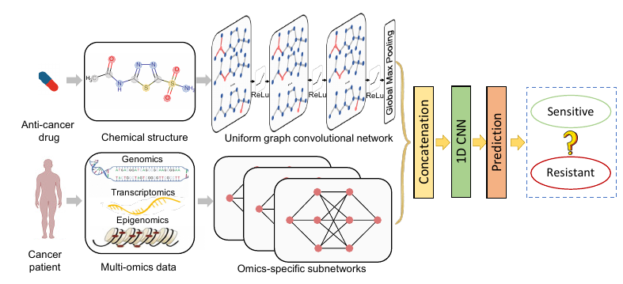

# A Re-Implementation of the DeepCDR Machine Learning Model

The problem of drug discovery is arduous and expensive. On average, it takes 2.6 billion dollars over 10 years just 
to develop one drug. AI, however, brings the promise of revolutionizing this process. DeepCDR is such an example of 
a model that is attempting to improve the process of drug discovery. In particular, it seeks to remove the process 
of experimentation for testing drug efficacy in labs. It does this through its hybrid convolutional/graph neural network 
architecture, which predicts the IC50 value between a potential drug and cancer cell line. This IC50 value will 
characterize the strength of the bond, therefore predicting whether the drug is potent at low concentrations. 

# Model

The model takes in a graph representing a drug's molecular structure, and 3 vectors that represent the gene mutation, 
gene expression, and methylation data. The drug's molecular structure is fed through a graph neural network, the gene 
mutation data is fed through a 1D convolutional neural network, and the gene expression and methylation data are fed 
through independent fully connected neural networks. After extracting features from all the networks, these features 
are concatenated and sent to a 1D convolutional neural network followed by a fully connected layer for regression. 

# Setup/Hyperparameter Tuning

1. Install the relevant libraries with the requirements.txt
2. Run python tools/hp_finder.py
3. Add --use_gpu flag if you wan to run hyperparameter tuning using the gpu
